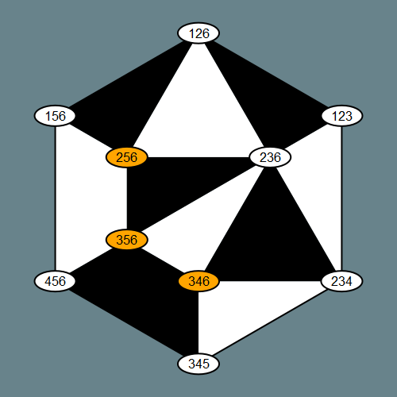
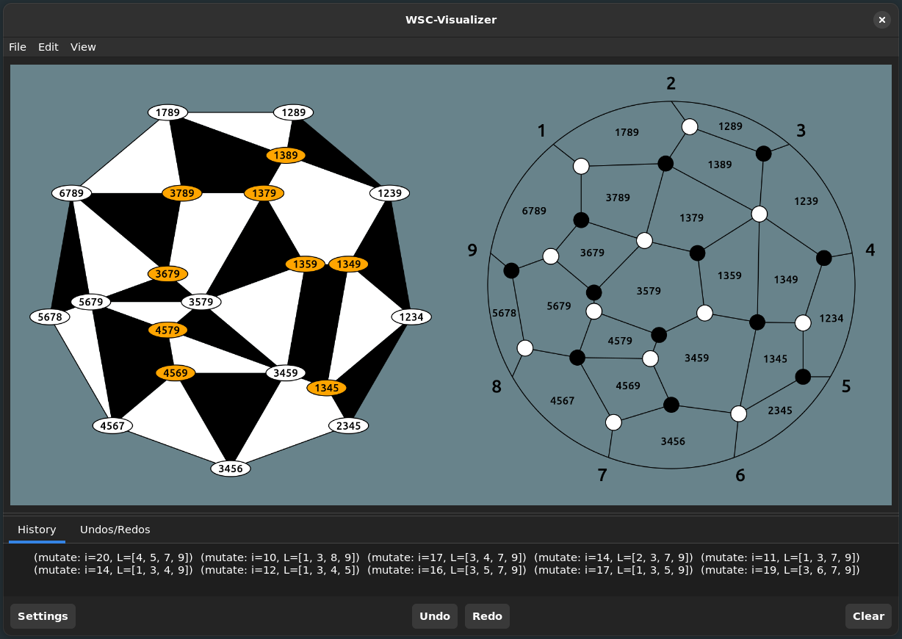

[](https://github.com/MichaelSchloesser/WeaklySeparatedCollections.jl/actions/workflows/ci.yml)

In its core, this package implements the combinatorics of weakly separated collections.
It also provides optional tools for plotting as well an intuitive graphical user interface.

---

## Table of Contents
0. [Introduction](https://github.com/MichaelSchloesser/WeaklySeparatedCollections.jl)<br>
1. [Installation](#installation)<br>
1.1. [Base Package](#base-package)<br>
1.2. [Extensions](#extensions)<br>
3. [Documentation](#documentaion)<br>
4. [Showcase](#showcase)<br>

---

## Installation
This package is divided into severaral parts. The base package implements only the combinatorics while several optional extensions can be loaded to enable additional features such as plotting.

### Base package

To install the package execute the following in the Julia REPL:

```julia
import Pkg;
Pkg.add(url="https://github.com/MichaelSchloesser/WeaklySeparatedCollections.jl")
```

The package may then be used as usual via

```julia
using WeaklySeparatedCollections
```

### Extensions
To enable extensions Julia v1.9 or newer, as well as some additional packages need to be installed.

#### Plotting
To use this feature, [Luxor](https://github.com/JuliaGraphics/Luxor.jl) needs to be installed. In the Julia REPL simply execute:

```julia
import Pkg;
Pkg.add("Luxor")
```

Now load both WeaklySeparatedCollections and Luxor to activate the plotting extension:

```julia
using WeaklySeparatedCollections
import Luxor 
```

#### GUI
To use the graphical user interface, [Luxor](https://github.com/JuliaGraphics/Luxor.jl) and [Mousetrap](https://github.com/Clemapfel/Mousetrap.jl) are required.
Installing Luxor is explained in the previous section. To install Mousetrap run:

```julia
import Pkg;
Pkg.add(url="https://github.com/clemapfel/mousetrap.jl")
```

Now loading all of WeaklySeparatedCollections, Luxor and Mousetrap will activate the gui extension.

```julia
using WeaklySeparatedCollections
import Luxor
import Mousetrap
```

#### Oscar
We extend some functionality of [Oscar](https://github.com/oscar-system/Oscar.jl) and add methods to handle the A-cluster mutation of Seeds coming from weakly separated collections as well as the associated newton-okounkov-bodies.

This extension is only supported for Linux users (although Windows users may use Linux from Windows via [wsl](https://learn.microsoft.com/en-us/windows/wsl/)).
We refer to the official [Oscar website](https://www.oscar-system.org/install/) for details of the installation.

Afterward using the loading the extension is as simple as typing

```julia
using WeaklySeparatedCollections
using Oscar
```

---

## Documentaion

The stable Documentaion is available [here](https://michaelschloesser.github.io/WeaklySeparatedCollections.jl/stable/). This includes a brief introduction to the required mathematical background, as well as a description of all functions and types.

The developer documentation can be found [here](https://michaelschloesser.github.io/WeaklySeparatedCollections.jl/dev/).

---

## Showcase

Easily load predefined weakly separated collections and plott them for example in a jupyter sheet:

```julia
H = rectangle_collection(3, 6)
drawTiling(H) # plotts H as plabic tiling
```


```julia
H = rectangle_collection(3, 6)
drawPLG_straight(H; drawLabels = true) # plotts H as plabic graph with straight edges
```


Save images as png, svg, pdf or eps file:

```julia
H = checkboard_collection(3, 6)
# will save the image as title.png (by defalut without background)
drawPLG_straight(H, "title.png"; drawLabels = true)
```


Easily mutate collections:
```julia
H = rectangle_collection(3, 6)
mutate!(H, [3,5,6]) # mutate at label 356
drawPLG_straight(H, drawLabels = true) # plott result
```


Visualize, mutate by clicking, save and load collections (and much more) using the graphical user interface:

```julia
H = rectangle_collection(4, 9)
visualizer!(H)
```


