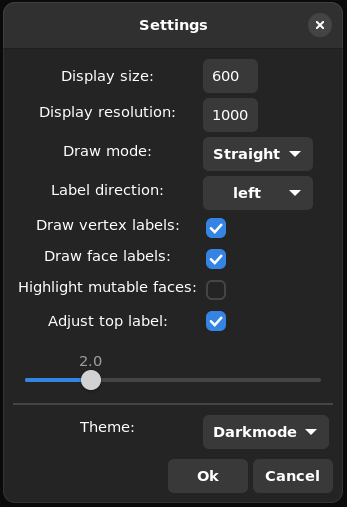
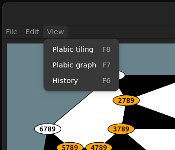

# User guide

## Introduction

We start off by giving some mathematical background, or rather by defining the needed language.

### Weakly separated Collections

For any integer $n \geq 1$ we use the notation $[n]:=$ \{ $1, 2, \ldots, n$ \} and denote by $\text{Pot}(k,n)$ the set of $k$-subsets of $[n]$.

#### Definition (weak separation)
Let $I, J$ be $k$-subsets of $[n]$, then we call $I$ and $J$ $\textbf{weakly separated}$ if we cannot find elements $a, c \in I \setminus J$ and $b, d \in J \setminus I$ such that 
$(a, b, c, d)$ is strictly cyclically ordered. In this case we write $I \parallel J$. 

Intuitively two $k$-subsets are weakly separated if after can arranging $I \setminus J$ and $J \setminus I$ clockwise on a circle, they can be separated by a line.

#### Definition (weakly separated collection)
A subset $\mathcal{C} \subseteq \text{Pot}(k,n)$ is called a $\textbf{weakly separated collection}$ (abbreviated by WSC) if its elements are pairwise weakly separated. 
We often referr to elements of a WSC as labels.

#### Definition (mutation)
If $\mathcal{C}$ is a WSC that includes sets of the form $Iab, Ibc, Icd, Iad$ and $Iac$, where $(a,b,c,d)$ is strictly cyclically ordered. 
Then $$\mathcal{C'} = (\mathcal{C} \setminus \{Iac\}) \cup \{Ibd\}$$ is also a weakly separated collection, and we call the exchange of $Iac$ by $Ibd$ a $\textbf{mutation}$.

### Plabic Tilings

#### Definition (plabic tiling)
Any WSC can be given the structure of an abstract $2$-dimensional cell complex, which in turn may be embedded into the plane.
This construction will be called an (abstract) $\textbf{plabic tiling}$, and we referr to 
TODO for the mathematical details.

Intuitively a plabic tiling is a tiling of a convex $n$-gon into convex polygons, colored either black or white, and with vertices labelled by the elements of the underlying WSC.
Plabic tilings are in bijective correspondance with WSC's that are maximal with respect to inclusion.

### Plabic Graphs

#### Definition (plabic graph)
A $\textbf{plabic graph}$ is a finite simple connected plane graph $G$ whose interior is bounded by a vertex disjoint cycle containing $n$ $\textbf{boundary vertices}$ 
$b_1, \ldots, b_n$. Here the labelling is chosen in clockwise order.

We only consider $\textbf{reduced}$ plabic graphs which can be also seen to be in one to one correspondance to WSC's that are maximal with respect to inclusion. 
For more details we referr to TODO.

## Creating WSC's

!!! note "Vectors instead of sets"
    In this package we use vecors in place of sets, although WSC's are by definition sets of $k$-sets. 
    We always assume such vectors to be increasingly ordered and not contain double elements. 
    None of the below methods check these properties and unforseen behavior may arise if they are not fulfilled.

The data type for WSC's or rather (abstract) plabic tilings is given by `WSCollection`.

```@docs
WSCollection
```

### Constructors

There are three different constructors to create a WSC:

```@docs
WSCollection(k::Int, n::Int, labels::Vector{Vector{Int}}; computeCliques::Bool = true)
WSCollection(k::Int, n::Int, labels::Vector{Vector{Int}}, quiver::SimpleDiGraph{Int}; computeCliques::Bool = true)
WSCollection(collection::WSCollection; computeCliques::Bool = true)
```

Thus to construct a WSC we only need to know its labels.

#### Examples:

```@example constructors
using WeaklySeparatedCollections # hide
labels = [[1, 5, 6], [1, 2, 6], [1, 2, 3], [2, 3, 4], [3, 4, 5], 
          [4, 5, 6], [2, 5, 6], [2, 3, 6], [3, 5, 6], [3, 4, 6] ]
is_weakly_separated(6, labels) # checks for pairwise weak separation
```

```@example constructors
C = WSCollection(3, 6, labels)
```

However, if the underlying quiver is already known it can be passed to the constructor to speed up computations.

```@example constructors
Q = C.quiver
WSCollection(3, 6, labels, Q)
```

The last constructor is useful, if we already have a WSC but want to omit the 2-cells or if the 2-cells of our WSC are missing and we want to compute them.

```@example constructors
D = WSCollection(C, computeCliques = false)
cliques_missing(D) # checks if the cliques (i.e. the 2-cells) are missing
```

```@example constructors
D = WSCollection(D)
D.whiteCliques
```

### Extending to maximal collections

Sometimes we only want some maximal WSC containing one or more disired labels. To obtain such WSC's we simple add labels to our desired as long as possible.

```@docs
extend_weakly_separated!
extend_to_collection
```

#### Examples:

We may extend using brute force:

```@example extend
using WeaklySeparatedCollections # hide
label = [1, 3, 4]
extend_weakly_separated!(3, 6, [label])
```
Or if we want to prefer labels from a known weakly separated set (and then fill up by brute force):

```@example extend
label = [1, 3, 4]
preferred_labels = [[1, 5, 6], [1, 2, 6], [1, 2, 3], [2, 3, 4], [3, 4, 5], 
                    [4, 5, 6], [2, 5, 6], [2, 3, 6], [3, 5, 6], [3, 4, 6]]
extend_weakly_separated!(3, 6, [label], preferred_labels)
```

We could have just as well passed a WSC instead of `preferred_labels` above. Note that so far we only constructed arrays of labels.
To obtain a WSC containing these labels we use `extend_to_collection`.

```@example extend
label = [1, 3, 4]
extend_to_collection(3, 6, [label], preferred_labels)
```

## Predefined collections
We provide shortcuts for the construction of some well known WSC's:

```@docs
checkboard_collection
rectangle_collection
dual_checkboard_collection
dual_rectangle_collection
```

#### Examples:

```@example predefined
using WeaklySeparatedCollections # hide
rectangle_collection(3, 6)
```

If we only want the underlying labels we may instead use `rectangle_labels(k::Int, n::Int)` (similar for the other predefined collections).

```@example predefined
rectangle_labels(3, 6)
```

The labels of the rectangle collection can be arranged on a grid in a natural way. Specific labels in this grid are returned by `rectangle_label(k::Int, n::Int, i::Int, j::Int)`
where $i = 0, ..., n-k$ and $j = 0, ..., k$ (similar for the other collections, where for the dual ones $i = 0, ..., k$ and $j = 0, ..., n-k$ ).

```@example predefined
rectangle_label(3, 6, 1, 2)
```

## Basic functionality
Armed with this plethora of examples, we are ready to discuss the basic functionalities of WSC's.

WSC's behave in many ways as their underlying arrays of labels would. In particular labels may be accessed directly.

```@example access
using WeaklySeparatedCollections # hide
rec = rectangle_collection(3, 6)
rec[3]
```

```@example access
rec[7] = [1, 3, 6]
```

Caution is advised when modifying labels as above, as it is not checked if the resulting labels are still weakly separated nor is the associated data changed accordingly.

For convenience we also extend the following functions:

```@docs
in
length
intersect
setdiff
union
```

#### Examples:

```@example basics
using WeaklySeparatedCollections # hide
rec = rectangle_collection(3, 6)
check = checkboard_collection(3, 6)

check[10] in rec 
```

```@example basics
length(check)
```

```@example basics
intersect(rec, check) # similar for union and setdiff
```

## Mutation

WSC's usually contain `frozen` elements that never change. On the other hand some elements may be modified via mutation and are called `mutable`.
To figure out which elements of a WSC are frozen or mutable use the functions `is_frozen` or `is_mutable`.

```@docs
is_frozen
is_mutable
```

```@example frozen
using WeaklySeparatedCollections # hide
rec = rectangle_collection(3, 6)
is_frozen(rec, 4)
```

```@example frozen
is_mutable(rec, 7)
```

```@example frozen
is_mutable(rec, 8)
```

The frozen labels contained in any (maximal) WSC can be obtained via

```@docs
frozen_label
frozen_labels
```

The indices of the mutable labels on a WSC can be obtained by using

```@docs
get_mutables
```

Finally, to mutate a WSC in the direction of a mutable label, the functions `mutate`and `mutate!` are available.

```@docs
mutate!
mutate
```

#### Examples:

```@example mutation
using WeaklySeparatedCollections # hide
rec = rectangle_collection(3, 6)
get_mutables(rec)
```

```@example mutation
mutate!(rec, 7)
println(rec, full = true)
```

For convenience we may also mutate by specifying a label:

```@example mutation
mutate!(rec, [3,4,6])
println(rec, full = true)
```

## Other transformations

Apart from mutation, several other transformations of WSC's are available:

```@docs
rotate!
```

```@docs
reflect!
```

```@docs
complement!
```

```@docs
swap_colors!
```

For each of the above methods, a variant that does not modify its argument is avaliable (just omit the `!` ). 

#### Examples:

```@example transformations
using WeaklySeparatedCollections # hide
check = checkboard_collection(3, 6)
check.labels
```

```@example transformations
using WeaklySeparatedCollections # hide
check = checkboard_collection(3, 6)
rotate!(check, 1)
check.labels
```

```@example transformations
using WeaklySeparatedCollections # hide
reflect!(check, 1)
check.labels
```

### Searching

In theory all WSC's of common type can be transformed into each other by mutations. In proctice however it is quite difficult to find a suitable sequence of mutations from one WSC to another. Thus we provide different searching algorithms to automate the search for such sequences.

On the conceptually easy end we have breadth and depth first search:

```@docs
BFS
```

```@docs
DFS
```

#### Examples:

```@example uninformed
using WeaklySeparatedCollections # hide
check = checkboard_collection(3, 7)
rec = rectangle_collection(3, 7)
BFS(check, rec)
```

```@example uninformed
DFS(check, rec)
```

If the target WSC is close enough, searching is also feasable for bigger parameters.

```@example uninformed
check = checkboard_collection(7, 16)
label = [1, 2, 3, 4, 5, 6, 15]
target = extend_to_collection([label], check)
DFS(check, target, limitSearchSpace = true)
```

For more informed searching we first need suitable heuristics, i.e. lower bounds on the number of mutations needed to reach a WSC from a given one.

```@docs
number_wrong_labels
```

```@docs
min_label_dist
```

```@docs
min_label_dist_experimental
```

#### Examples:

```@example heuristics
using WeaklySeparatedCollections # hide
check = checkboard_collection(10, 20)
rec = rectangle_collection(10, 20)
number_wrong_labels(check, rec)
```

```@example heuristics
min_label_dist(check, rec)
```

```@example heuristics
min_label_dist_experimental(check, rec)
```

The above heuristics can be used for the Astar algorithm by passing the corresponding enum.

```@docs
Astar
```

#### Examples:

```@example Astar
using WeaklySeparatedCollections # hide
check = checkboard_collection(3, 8)
rec = rectangle_collection(3, 8)
Astar(check, rec)
```

```@example Astar
check = checkboard_collection(4, 9)
rec = rectangle_collection(4, 9)
Astar(check, rec, heuristic = MIN_LABEL_DIST_EXPERIMENTAL)
```

Sometimes we only want to find a sequence of mutations from some WSC to any WSC containing some desired label. 

```@docs
find_label
```

```@example find_label
using WeaklySeparatedCollections # hide
check = checkboard_collection(4, 9)
label = [2, 3, 4, 9]
s = find_label(check, label, heuristic = MIN_LABEL_DIST_EXPERIMENTAL)
```

Lets test the found sequence

```@example find_label
for i in s
    mutate!(check, i)
end

check[21] # = label
```

Finally to get an overview we can calculate all WSC's of a given type and connect those who arise from each other by mutation by an edge. 
The resulting Graph is also called the generalized associahedron.

```@docs
generalized_associahedron
```

```@example Astar
using WeaklySeparatedCollections # hide
root = checkboard_collection(3, 7)
list, A = generalized_associahedron(root)
A
```

The obtained Graph may be plotted in 3D using external libraries such as [GraphMakie](https://github.com/MakieOrg/GraphMakie.jl):

```
max = length(root) - root.n
n_mutables = a -> length(get_mutables(list[a]))
min = minimum(n_mutables(a) for a in 1:nv(A))
d = max - min

# greener means more mutable faces, red means less mutable faces.
node_colors = [RGBA(1.0 - (n_mutables(a) - min)/d, (n_mutables(a) - min)/d, 0.0, 1.0) 
                for a in 1:nv(A)]

graphplot(A, layout = Spring(dim = 3, seed = 1), edge_width = 0.5, node_size = 15, 
            node_color = node_colors)
```


## Plotting

Plotting WSC's requires `Luxor` to be installed and loaded as detailed [here](https://michaelschloesser.github.io/WeaklySeparatedCollections.jl/stable/#Extensions).

!!! note "only maximal WSC's supported"
    plotting is currently only available for maximal weakly separated collections.

In the introduction we learned about plabic tilings as well as plabic graphs as objects living in the plane which are in one to one correspondance to maximal WSC's.
Thus we can plot a maximal WSC using its corresponding plabic tiling or plabic graph. The functions to accomplish this are:

```@docs
drawTiling
```

```@docs
drawPLG
```

#### Examples:

If working in a Jupyter sheet, WSC's may be plottet directly without saving the image in a file.

```
H = rectangle_collection(3, 6)
drawTiling(H) # plotts H as plabic tiling
```


```
H = rectangle_collection(3, 6)
drawPLG_straight(H; drawLabels = true) # plotts H as plabic graph with straight edges
```


To save an image as png, svg, pdf or eps file, we just need to give it a title with the corresponding file extension.

```
H = checkboard_collection(3, 6)
# will save the image as title.png (by defalut without background)
drawPLG_straight(H, "title.png"; drawLabels = true)
```


## Graphical user interface

The graphical user interface requires both an installation of `Luxor` as well as `Mousetrap`. See [here](https://michaelschloesser.github.io/WeaklySeparatedCollections.jl/stable/#Extensions) for details.

While plotting WSC's enables us to visualize them, the resulting images lack interactivity. This is where the built in gui application comes in handy. To start it we use

```@docs
visualizer!
```


Much of the functionality discussed so far is available through this interface, for example to mutate a WSC in the direction of a label we can just click on it.

We shortly explain the content of the menubar as well as settings.

### Settings



- `Draw mode` controls how edges of the plabic graph are drwn. The available modes are `Straight`, `Smooth` and `Polygonal`

- `Label direction` controls whether the left (i.e. the usual ones) or right labels (complements of left labels) are drawn.

- `Draw vertex labels` controls if the labels in the plabic tiling should be drawn or not.

- `Draw face labels` controls whether the labels in the plabic graph are drawn or not.

- `Highlight mutable faces` enables the highlighting of mutable faces of the plabic graph. This only works if the drawmode is set to `Straight`.

- `adjust top label` if checked then a the boundary label of the plabic graph that should be drawn at the top can be chosen through the slider below. This adjusts both the embedding of the plabic graph as well as the corresponding tiling.

### File

Through the File submenu we may save or load WSC's. 


Moreover we can also easily export the images drawn in the gui as png, svg, pdf or eps file


### Edit

The Edit submenu contains transformations other than mutation, such as rotations and reflections as well as a quick way to load all the predefines WSC's.


### View

Finally under the view submenu all options to disable/enable parts of the gui are collected.



## Oscar extension

This extension requires an installation of Oscar [Oscar](https://github.com/oscar-system/Oscar.jl) (see also [Oscar website](https://www.oscar-system.org/install/)).

### The action of the dihedral group

There is a natural action of the dihedral group on WSC's (realised as permutation group) induced by applying permutations to $k$-sets.

!!! note "Notation"
    Most computer algebra systems, in particular Oscar, preferr rigth actions over left actions. Thus a permutation $\pi \in S_n$ is applied to $x \in [n]$ from the right.
    We define $x^\pi := \pi(x)$. As a consequence we need to consider Permutation groups with the opposite product $\pi * \tau := \tau \circ \pi$, where the right hand side is the usual composition of functions. This ensures $x^{\pi * \tau} = (x^\pi)^\tau$.

```@docs
Base.:^
```

We extend several Oscar functions to simplify their usage with WSC's. We urge the reader to consult the Oscar documentaion, specifically the sections 
[Permutation Groups](https://docs.oscar-system.org/stable/Groups/permgroup/) and [Group Actions](https://docs.oscar-system.org/stable/Groups/action/) for more information about their usage.

```@docs
Oscar.gset
Oscar.orbit
Oscar.stabilizer
```

#### Examples:

```@example action
using WeaklySeparatedCollections # hide
using Oscar # hide
s, t = cperm(collect(1:6)), perm([1, 6, 5, 4, 3, 2])
check = checkboard_collection(3, 6)

println(check^t, full = true)
```

```@example action
check^(s*t) == (check^s)^t
```

```@example action
D = dihedral_group(PermGroup, 6)

gset(D, [check])
```

```@example action
collect(orbit(check))
```

```@example action
S, _ = stabilizer(check)
collect(S)
```

### Seeds

We provide basic funtionality to handle the A-type cluster induced by WSC's

```@docs
Seed
```

Clustervariables of a seed may be accessed as elements of arrays:

```@example seed
using WeaklySeparatedCollections # hide
using Oscar # hide
check = checkboard_collection(3, 6)
seed = Seed(check)
println(seed[5])
```

For quality of life:

```@example seed
length(seed)
```

Seeds usually contain frozen which cannot be mutated. Thus we exten `is_frozen` for usage with seeds:

```@docs
is_frozen(seed::Seed, i::Int)
```

The remaining variables of a seed can be mutated via 

```@docs
mutate!(seed::Seed, i::Int)
mutate(seed::Seed, i::Int)
```

#### Examples:

```@example seed
println(seed, full = true)
```

```@example seed
is_frozen(seed, 7)
```

```@example seed
mutate!(seed, 7)
println(seed[7])
```

As hinted at earlier, for some WSC's it makes sense to arrange their labels on a (extended) grid. Thus it is only natural to also think of the associated cluster variables as arranged on the same grid. 

```@docs
grid_seed
extended_rectangle_seed
extended_checkboard_seed
```

#### Examples:

```@example seed
check = checkboard_collection(3, 6)
s = grid_seed(check)
println(s, full = true)
```

```@example seed
s, X = extended_rectangle_seed(3, 6)
X
```

### Superpotential and Newton Okuounkov bodies

The Superpotential is defined as the rational function $W = \sum_{i \neq k} W_i + W_k*q$ on $Gr_{n-k, n} \times \mathbb{C}$. Using the A-cluster structure of the coordinate ring of $Gr_{n-k, n}$ we can rewrite the superpotenial in terms of a given seed. In particular to write $W$ in terms of a seed associated to a WSC, we have the functions:

```@docs
get_superpotential_terms
checkboard_potential_terms
```

#### Examples:

Rewriting $W$ in terms of a given WSC is as simple as

```@example superpotenial
using WeaklySeparatedCollections # hide
using Oscar # hide
rec = rectangle_collection(3, 6)
get_superpotential_terms(rec)
```

Here the variable $q$ is ommited, as it is understood that it should be multiplied with the $k$-th term. We may pass a custom seed to the above function. This is useful if we want the variables to have specific names.

```@example superpotenial
s, _ = extended_rectangle_seed(3, 6)
get_superpotential_terms(rec, s)
```

For some WSC's like the checkboard collection, we can make use of closed formulas to obtain the terms of $W$.

```@example superpotenial
checkboard_potential_terms(3, 6)
```

Beeing able to rewritte $W$ in terms of a WSC makes it simple to obtain the defining inequalities of its associated Newton Okuounkov bodies as well as the latter itself.

```@docs
newton_okounkov_inequalities
checkboard_inequalities
newton_okounkov_body
checkboard_body
```

```@example superpotenial
    A, b = newton_okounkov_inequalities(rec)
    println(A, b)
```

```@example superpotenial
    A, b = checkboard_inequalities(3, 6)
    println(A, b)
```

```@example superpotenial
    N_rec = newton_okounkov_body(rec)
```

```@example superpotenial
    N_rec.pm_polytope.HASSE_DIAGRAM.FACES
```

```@example superpotenial
    checkboard_body(3, 6)
```

